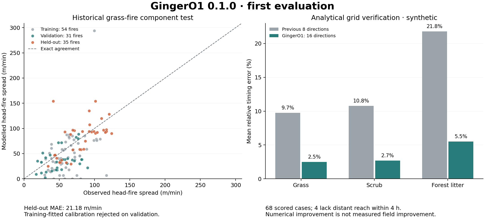

# GingerO1 0.1.0

GingerO1 is the versioned experimental simulation engine used by the SAGE investigation workspace. It is not a new language model. Existing saved SAGE runs retain their original engine labels; new runs export a model name, version, validation boundary and travel stencil.

## Evidence delivered

- **Field component benchmark:** 120 eligible historical grass-fire experiments from CSIRO's Annaburroo dataset v3. Measured dead-fuel moisture and the published derived midflame wind drive the existing Anderson fuel-1 spread calculation. The target is observed plot-average head-fire spread rate, not a model-generated target. One record is excluded for missing inputs.
- **Chronological evaluation:** 54 fires on eight training days, 31 fires on three validation days, 35 fires on three test days. No fire or burn day crosses splits. A single bounded multiplicative calibration is fitted on training days, selected on validation, and not revised from test outcomes.
- **Additional diagnostics:** leave-one-burn-day-out evaluation across 14 days, treatment breakdowns and 2,000 deterministic paired day-bootstrap resamples. Resamples and repeated calculations are not additional independent fires.
- **Numerical verification:** compare eight-direction and sixteen-direction propagation against the analytical point-source elliptical arrival solution, across three fuel proxies, two grid sizes, three wind speeds and four wind directions. This checks the propagation algorithm, not field accuracy. Finite-horizon missed cells are counted separately from timing error on shared reached cells.

The initial fitted scale (0.80) **failed validation**: day-balanced MAE increased from 24.68 to 26.79 m/min. It was rejected. The held-out baseline MAE is 21.18 m/min over 35 fires; across all 120 fires baseline MAE is 25.15 m/min. Calibration is not installed in the live engine. A zero improvement interval for the selected test model means it is the identical baseline, not certainty about wildfire error.

The numerical suite completed **72 cases / 144 full ensemble runs / 1,296 member runs**. Of these, 68 cases support timing scoring; four still-air forest-litter cases at 25 m do not reach the comparison annulus (at least three cells from the origin) within four hours and remain explicitly unscored. Mean case relative timing error fell from **13.65% to 3.45%**, a **74.72% numerical reduction**. No case increased missed analytical reach. These figures do not establish a corresponding improvement against real-fire perimeters.



Source: Gould, Jim; Gomes Da Cruz, Miguel; Sullivan, Andrew (2023), *1986 Annaburroo Experimental Grassland Fire Data*, v3, CSIRO. [Versioned collection](https://data.csiro.au/collection/csiro:60062). The downloaded manifest preserves the repository's exact attribution and CC BY 4.0 license. [Research article and variable definitions](https://doi.org/10.1071/WF23100).

## What changed in the engine

The default surface propagation stencil has 16 directions, adding eight length-√5 edges to the eight nearest neighbours. Every intersected cell contributes to the harmonic travel rate. Every crossed cell is checked for nonburnable/unknown fuel; diagonal corner guards prevent paths slipping between blocked cells. Weather still changes at 30-minute integration frames. The old `legacy8` option remains available only as an internal offline benchmark argument.

This reduces grid-direction error under the reference conditions. It does not improve fuel classification, model crown fire or embers, resolve building airflow, or turn hypothetical structural distance/delay rules into physical ignition predictions. Structural assumptions remain identical across sensitivity members.

## Reproduction

```sh
npm run fetch:ginger-o1        # optional: fetch original tables again, using bounded ZIP ranges
npm run backtest:ginger-o1     # verify source hashes, fit on training, evaluate and save reports
npm run benchmark:ginger-o1    # analytical grid suite; no external data or network
npm run benchmark:ginger-o1:runtime # 2 km synthetic compute check; excludes network/buildings
npm run test:ginger-o1
npm run typecheck:ginger-o1
npm run test:sage
npm run test:investigation
```

`data/ginger-o1/annaburroo/source.json` contains immutable source version, retrieval date, exact attribution and CSV SHA-256 values. Original CSVs are preserved. The importer downloads only the two tables from the archive, not its hundreds of megabytes of photographs. It verifies ZIP CRC and refuses a server response that ignores byte ranges.

`reports/ginger-o1/field-backtest.json` preserves splits, excluded IDs, per-fire predictions, every diagnostic fold, metrics and evaluator/source hashes. `FIELD-BACKTEST.md` provides a readable summary. `grid-benchmark.json` records the independent numerical comparisons. Repeating the same protocol is reproducibility, not an independent validation sample.

`python3 scripts/plot-ginger-o1.py` renders PNG/PDF comparison figures using matplotlib after the field and numerical reports exist. The 2 km, 6,400-cell, four-hour, nine-member synthetic runtime check with solar drying completed in 11.9 seconds on this machine; network loading and buildings are excluded, so this is not a worst-case latency guarantee.

## Historical perimeter evaluation

```sh
npm run backtest:perimeters -- cases.json report.json
```

The input is an array of cases. Each case supplies `id`, `eventId`, `split` (`train`, `validation`, `test`), past `origin`, a complete `Landscape` snapshot and `RunRequest`, plus:

```json
{
  "provenance": {
    "weatherKind": "reanalysis",
    "weatherSource": "Dataset/version and date range",
    "landscapeSource": "Pre-fire vegetation, terrain and inventory dataset/version",
    "landscapeValidAt": "2020-01-01T00:00:00Z",
    "initialExtentSource": "Source of the initial observed perimeter"
  },
  "observations": [
    {"at": "2020-08-01T12:30:00Z", "source": "Independent later perimeter source", "geometry": {"type": "Polygon", "coordinates": []}}
  ]
}
```

The example is a field guide, not executable observed data: supply a valid sourced polygon. The request must contain an initial observed extent at exactly `origin` in `experiment.observation`. Later observations must be strictly after origin and within the 1/2/4-hour horizon. All cases from an event must share one split. The evaluator uses supplied historical inputs only, never today's weather. It reports overlap, missed/extra hectares, boundary contact, fuel coverage and explicit failed cases. It does not silently pool only successful cases or tune parameters.

Source labels are operator assertions, not proof of authenticity. Reanalysis/observed-weather hindcasts must be distinguished from archived-forecast tests. A pre-event timestamp alone does not establish that an input was actually available at the forecast origin. Manually verify acquisition dates, sensor resolution and observation uncertainty.

No real historical perimeter cases were evaluated in this release. Public daily progression datasets cannot establish four-hour or individual-building arrival accuracy without additional observations at the appropriate spatial and temporal resolution. The Australian grass experiments validate only a component under retrospective supplied inputs, not the complete Catalan forecasting workflow.

## Next acceptance gates

1. Add independent Catalan/Mediterranean grass, scrub and forest incidents with pre-fire fuel maps and timestamped perimeters. Freeze event-level held-out sets before tuning.
2. Measure perimeter overlap, missed area, false exposure and arrival error across wind, terrain, wet-weather and extreme-fire regimes; report failed/out-of-domain cases too.
3. Acquire measured fuel/moisture and model rain wetting, crown fire and ember transport with separately validated mechanisms.
4. Require independent building-exposure and ignition data before evaluating or claiming structural accuracy.

GingerO1 remains experimental. More runs cannot compensate for missing mechanisms, unsuitable observations or lack of out-of-region validation.
